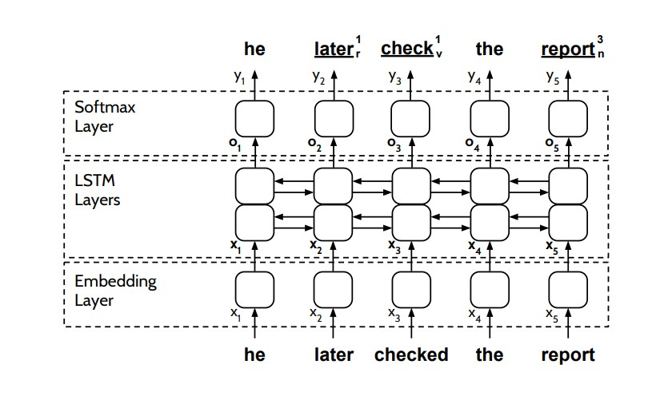

# LSTM-Word-Sense-Disambiguation

This project implements the paper [Neural Sequence Learning Models for Word Sense Disambiguation](http://wwwusers.di.uniroma1.it/~navigli/pubs/EMNLP_2017_Raganatoetal.pdf).

The task is to Implement and train a system capable of performing both fine-grained and coarse-grained Word Sense Disambiguation (WSD) using sense annotated English sentences from a corpora, and implementing an evaluation task (predictions) to test the model.

Fine-grained inventories contain lots of well refined senses for every lemma, therefore they tend to suffer from over-specification and sparsity, while coarse-grained inventories collect senses into more general categories thus reducing the sparsity of the data, however, they usually end up with less specific/informative senses for every lemma.

The coarse-grained categories are [Wordnet Domains](http://wndomains.fbk.eu/) and [Lexicographer’s IDs (LexNames)](https://wordnet.princeton.edu/documentation/lexnames5wn), both of which have mapping files in the `resources` folder.


The image below is a graphical representation of the full pipeline and baseline model of this implementation





[Read the report here](report.pdf)

This project was done as part of a graduate degree NLP course with [Prof. Navigli](http://wwwusers.di.uniroma1.it/~navigli/) ([BabelNet](https://babelnet.org/)) at Sapienza University of Rome.


## How to train

The trained WSD is too large to upload on this repo so training is absolutely required. 
However, the other files required to test the model (after training) - the jupyter notebooks in the `code` folder, the mapping files and the vocabulary from the training set in the `resources` folder, and the validation dataset in the `data` folder - are present in this repo.

To train, download [the SemCor and OMSTI sense annotated dataset](http://lcl.uniroma1.it/wsdeval/), extract it, then follow the code in [this notebook](code/200k_data_baseline_model_A.ipynb) in the `code` folder (don't forget to consolidate the paths to correspond with the new paths).

Training consists of parsing and preprocessing the corpora, and training the model. 
The code to preprocess are functions in `code/corpora.py`. The functions both extract the sentences in the xml corpora and preprocess them. The usage is as follows:

```
from corpora import *

outfolder_path = 'data/Training_Corpora/semcor+omsti/'
corpora_xml_path = outfolder_path + 'semcor+omsti.data.xml'
gold_mapping_path = outfolder_path + 'semcor.gold.key.txt'
resources_path = 'resources/'

extract_training_data(corpora_xml_path, gold_mapping_path, resources_path, outfolder_path)
```

Please note that the senses that are disambiguated are only matching [BabelNet](https://babelnet.org/) and [WordNet](https://wordnet.princeton.edu/) synsets and this was written into the functions in `code/corpora.py`.

I experimented with a number of different model configurations, which I have added as different jupyter notebooks in the `code` folder, and more information about each configuration can be found in [the report](report.pdf). 


## How to test

Prediction is run a bit differently for WSD tasks. Instead of the regular argmax over the probability distribution in the output layer, the argmax is taken only over all the possible senses for the lemma to be disambiguated.

For the case of lemmas that never occurred during training, a backoff strategy called Most Frequent Sense (MFS) is used, where the predominant sense of a lemma is taken as the sense in that context.

Given the task as defined before, three predict functions are defined, one for the fine-grained predictions, and the other two for the two kinds of coarse-grained (WordNet domains and LexNames).

To run predictions, run the code below:

```
from predict import *

input_path = '../data/Evaluation_Datasets/ALL/ALL.data.xml'
output_path = '../data/Evaluation_Datasets/ALL'
resources_path = 'resources/'

predict_babelnet(input_path, output_path, resources_path)
```
This will create a predictions file in the `output_path` directory. Then score the predictions using the java scorer found in `data/WSD_Evaluation_Framework/Evaluation_Datasets` (follow the instructions in the `README` file)